# Infrastructure as Code with OCI Hands-on


본 핸즈온 문서는 Terraform과 Ansible을 활용하여 Oracle Cloud Infrastructure (이하 OCI)에서 클라우드 환경에 대한 프로비저닝과 환경 구성하는 과정을 다루고 있습니다. 본 과정을 통해서 Terraform과 Ansible에 대한 기본 사용법과 코드를 통한 인프라 및 서버 구성 자동화에 대한 경험을 해볼 수 있습니다.

## Objectives
* Terraform과 Ansible 이해
* OCI에서 Terraform을 활용한 클라우드 프로비저닝 자동화 실행
* OCI에서 Ansible을 활용한 서버 구성 자동화 실행

## Required Artifacts
* 인터넷 접속 가능한 랩탑
* OCI (Oracle Cloud Infrastructure) 계정
* SSH Terminal (windows Putty, macOS Terminal 등)

## 전체 시나리오
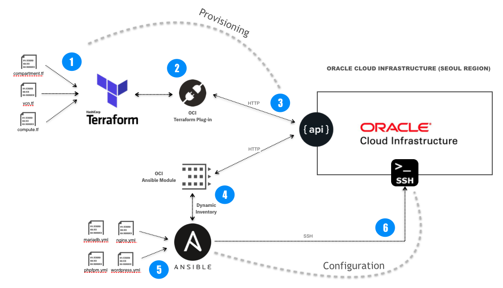

---

## 실습

### 실습 환경준비
1. 실습 환경(Linux)에 접속하기 위한 RSA Key Pair 다운로드 후 압축을 해제합니다.
    > 본 핸즈온 교육은 종료되었습니다.
 
2. 아래 URL로 접속해서 본인 이메일을 입력한 후 제출을 클릭하면 실습 환경정보를 확인할 수 있습니다.
    > 본 핸즈온 교육은 종료되었습니다.

3. 클라이언트 환경 접속

    #### Windows (Putty)
    Windows 사용자는 Putty를 사용하여 접속합니다.

    Putty 접속  
    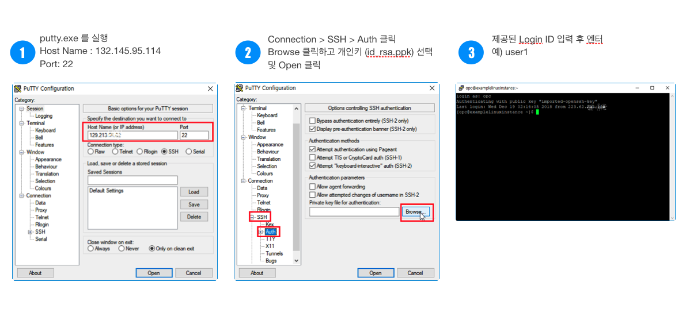

    #### macOS Terminal
    ```
    $ ssh -i ~/sshkeys/id_rsa {osuser}@{client_ip}
    ```

4. 접속하면 다음과 같이 실습을 위해 제공되는 환경 구성 파일과 rsa key (pem, der format)를 확인할 수 있습니다.
    ```shell
    $ ls -lart

      drwxr-xr-x.  2 user1 handson    87  1월 10 04:43 .oci
      drwxr-xr-x.  3 user1 handson    17  1월 15 00:49 .terraform
      drwx------.  2 user1 handson    80  1월 15 00:55 .ssh
    ```

    > .oci    ----------> oci python sdk에서 oci에 접속하기 위한 정보와 PEM Format Key  
    > .terraform  ----> terraform 실습에서 사용할 환경 변수   
    > .ssh  ----------> terraform으로 생성하는 Compute 환경에 접속하기 위한 DER Format Key

5. 접속한 실습 환경에서 실습을 위한 Terraform, Ansible 소스를 git clone을 통해서 다운로드 받습니다.  
   **$는 입력하지 않습니다.**
    ```shell
    $ git clone https://github.com/mangdan/meetup-200118-iac.git
    ```

<details>
<summary>
<font size=5>실습1) Terraform with OCI (Hands-On)</font>
</summary>

### Terraform 실습 시나리오
Terraform 실습에서는 Compartment 1개, Virtual Cloud Network(가상 클라우드 네트워크), Security List(보안 목록), Route Table (라우트 테이블), Internet Gateway (인터넷 게이트웨이)와 2개의 Compute Instance (Oracle Linux7)을 프로비저닝합니다.

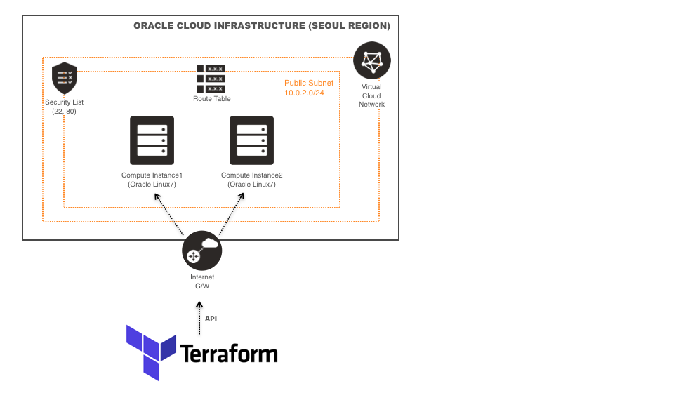

> 실습 환경에는 Terraform이 설치되어 제공됩니다.  
> Terraform 설치는 아래 URL을 참고합니다.  
> https://learn.hashicorp.com/terraform/getting-started/install.html

  * Terraform 설치 확인
    ```shell
    $ terraform version
    ```

### 실습용 Terraform 소스 구조
OCI용 테라폼 프로젝트의 디렉토리 구조는 다음과 같습니다.
> 실습에서 사용되는 모듈은 compartment, vcn, compute입니다.

  ```shell
  $ cd meetup-200118-iac/terraform
  ```

제공되는 샘플은 루트 경로에 provider.tf, main.tf, vars.tf가 존재하고 하위 폴더에 모듈을 구성해서 각 모듈을 실행하는 형태로 구성되어 있습니다.

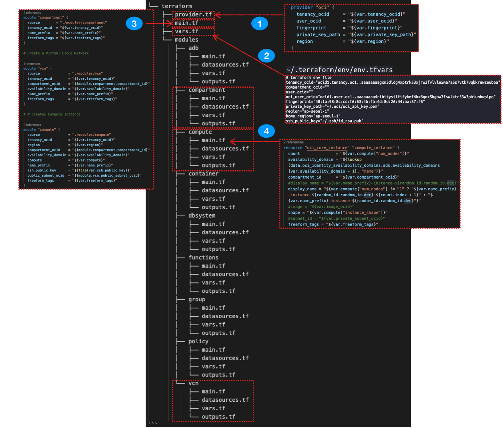

위 이미지의 내용은 다음과 같습니다.
1. OCI provider를 정의
2. terraform에서 사용할 변수 값을 정의하고 루트의 vars.tf에 값을 매핑
3. 실행할 모듈을 정의 (모듈로 변수값 전달)
4. 모듈별로 resource 정의

> Terraform의 변수는 기본적으로 환경변수 혹은 tfvars 파일에 정의한 값이 할당되는데, 할당된 변수값은 동일한 폴더 위치의 Block (resource, data등)에서 참조합니다. 따라서 상위 폴더의 변수의 값을 하위 모듈로 전달해야 하며, 하위 모듈의 경우도 동일하게 전달받을 변수를 가지고 있어야 합니다.

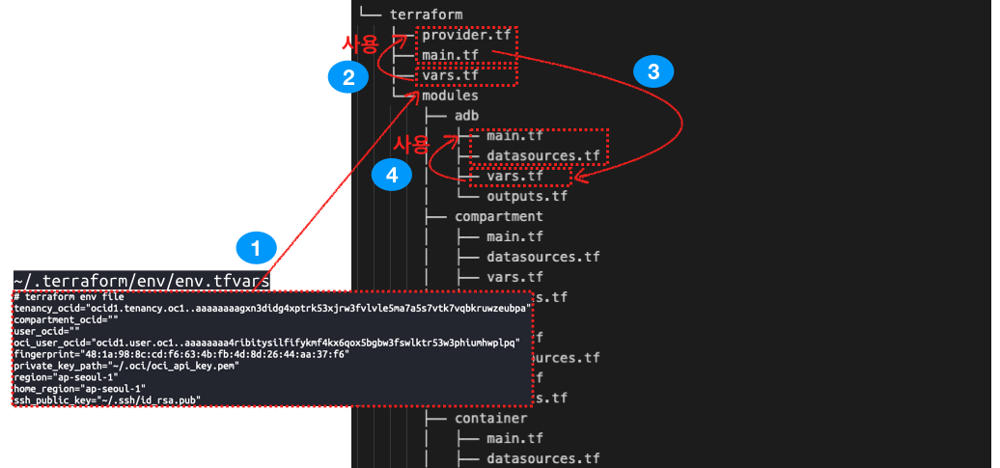

변수가 사용되는 방식은 다음과 같습니다.
1. env.tfvars에 정의된 값을 루트의 vars.tf에 할당
2. 루트의 vars.tf를 main.tf, provider.tf에서 사용
3. 루트의 main.tf에서 하위 모듈(compute, compartment, vcn)이 가지고 있는 vars.tf에 값을 전달
4. 각 모듈에서 동일한 위치에 존재하는 vars.tf 참조

### Terraform Init
이 작업은 provider에서 제공하는 terraform plugin을 OS환경에 맞게 다운로드 혹은 업데이트하며, 실행할 모듈의 정보에 대한 내용을 json파일로 생성합니다.

1. provider.tf가 있는 위치에서 다음과 같이 init을 실행합니다.
    ```shell
    $ cd meetup-200118-iac/terraform

    $ terraform init
    ```

2. OCI Plugin과 Module을 확인합니다.
    ```shell
    $ tree .terraform

    .terraform/
    ├── modules
    │   └── modules.json
    └── plugins
        └── linux_amd64
            ├── lock.json
            └── terraform-provider-random_v2.2.1_x4
    ```

### Terraform Plan
Terraform Plan을 실행하면 작성한 계획에 따라 정확히 수행되는지 미리 체크해볼 수 있습니다. HCL에 대한 검증도 함께 수행합니다. Plan 단계에서는 실제 인프라에 반영되지 않습니다.

* 동일한 경로에서 다음과 같이 수행합니다. **{os_user}** 부분을 자신의 os userid(e.g. user1)로 지정합니다.
    ```shell
    $ terraform plan -var-file="/home/{os_user}/.terraform/env/env.tfvars"

    Plan: 14 to add, 0 to change, 0 to destroy.
    ```

### Terraform Apply
실제로 인프라에 Terraform으로 구성한 계획을 실행합니다.

1. 동일한 경로에서 다음과 같이 수행합니다. 마찬가지로 **{os_user}** 부분을 자신의 os userid(e.g. user1)로 지정합니다.

    ```shell
    $ terraform apply -var-file="/home/{os_user}/.terraform/env/env.tfvars"
    ```

2. 실행하면 다음과 같이 Apply 실행에 대한 최종 Approve 여부를 물어봅니다. yes를 입력하고 엔터를 입력합니다.

    > apply와 destroy의 경우는 기본적으로 Approve 여부를 물어보는데, 실행시에 다음과 같이 auto-approve 옵션을 주면 Approve 단계를 건너뜁니다.  
    > terraform apply --auto-approve

    ```shell
    Do you want to perform these actions?
      Terraform will perform the actions described above.
      Only 'yes' will be accepted to approve.

      Enter a value: yes
    ```

3. 생성이 완료되면 다음과 같은 메시지를 볼 수 있습니다.
    ```shell
    Apply complete! Resources: 14 added, 0 changed, 0 destroyed.
    ```

### OCI Console에서 생성된 Resource 확인
1. 다음 주소로 OCI Console에 접속합니다.
    > https://console.ap-seoul-1.oraclecloud.com

2. 실습을 위해 각자 제공된 Cloud Tenant(e.g. meetup101)를 입력한 후 **Continue** 를 클릭합니다.
    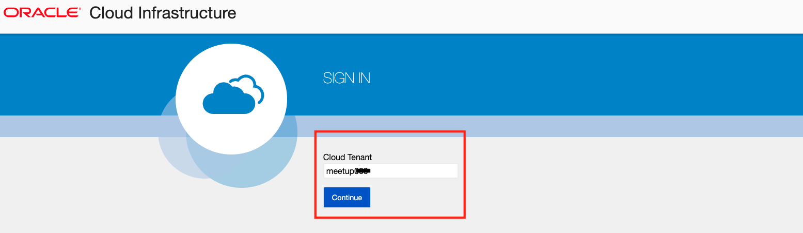

3. 실습을 위해 각자 제공된 OCI 계정(ID/PW)을 입력한 후 **Sign In** 을 클릭합니다.
    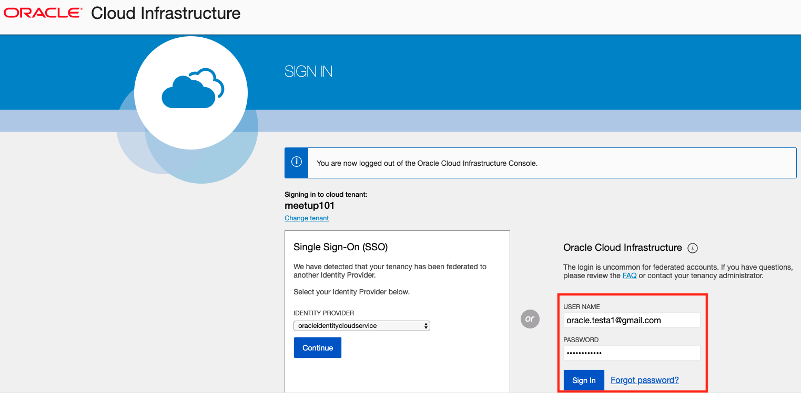

4. Compute Instance 확인을 위해 다음 페이지로 이동합니다.
    > 좌측 상단 햄버거 메뉴 > Compute > Instances
    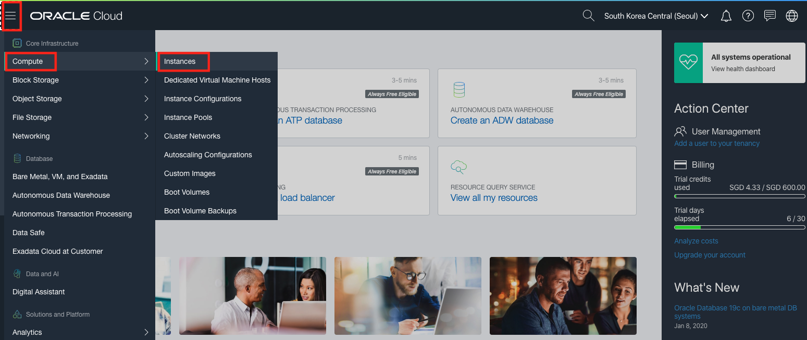

5. 생성된 Compartment와 Instance를 확인합니다.
    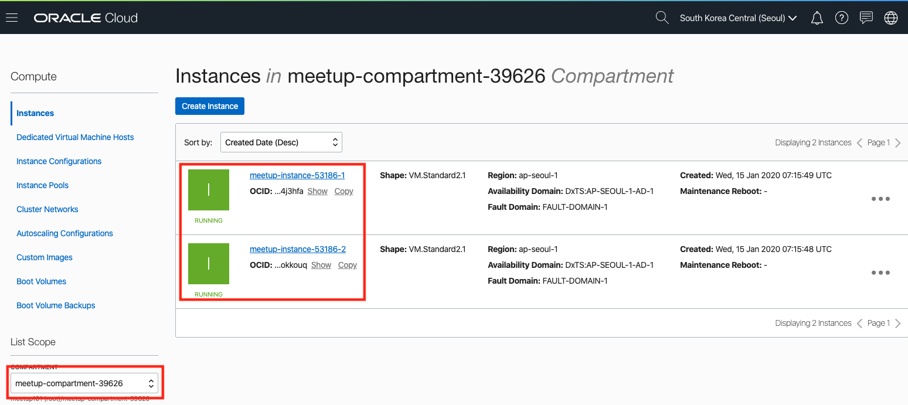

6. 마찬가지로 생성된 VCN 확인을 위해 다음 페이지로 이동합니다.
    > 좌측 상단 햄버거 메뉴 > Networking (네트워킹) > Virtual Cloud Networks (가상 클라우드 네트워크)

7. 생성된 VCN을 확인합니다.
    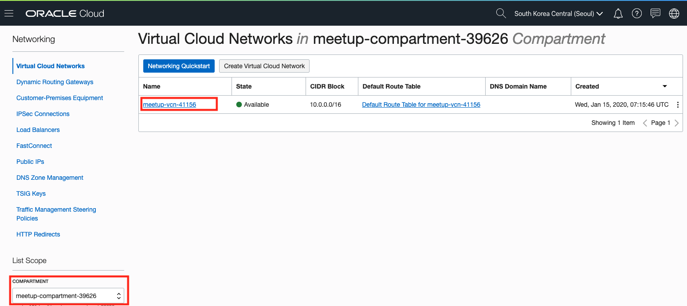

</details>

<details>
<summary>
<font size=5>실습2) Ansible with OCI (Hands-On)</font>
</summary>

### Ansible 실습 시나리오
Ansible 실습에서는 Terraform으로 프로비저닝한 환경에 WordPress, Nginx, MariaDB, php-fpm을 구성합니다.

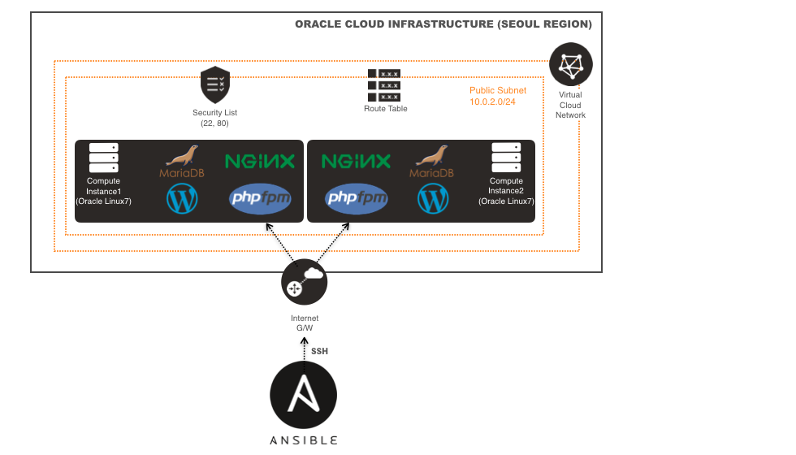

Ansible은 Python 기반으로 개발된 오픈소스로 Python2(2.7) 혹은 Python3(3.5+)를 필요로 합니다. 실습 환경에는 이미 Python2가 설치되어 제공되고 있으며, Python Package Manager인 pip와 Python 가상환경 (virtualenv)에서 실습을 위한 Python virtualenv가 설치되어 제공됩니다. 

  * python, pip, virtualenv 설치 확인
    ```shell
    $ python --version

    $ pip --version

    $ virtualenv --version
    ```

### Python virtualenv 생성 및 Ansible, OCI Python SDK 설치

1. virtualenv 환경 생성 및 가상환경을 실행합니다.
    ```shell
    $ virtualenv oci-ansible

    $ source ~/oci-ansible/bin/activate
    ```

    가상환경을 실행하면 Shell Prompt가 다음과 같이 변경됩니다.
    ```shell
    $ (oci-ansible)
    ```

2. Python 가상환경에 ansible 설치 및 설치 확인을 합니다.
    > $ (oci-ansible)은 입력하지 않습니다.

    ```shell
    $ (oci-ansible) pip install ansible

    $ (oci-ansible) ansible --version
    ```

3. OCI Python SDK를 설치합니다. 
    > Oracle에서 제공하는 OCI Ansible Module은 내부적으로 OCI에서 제공하는 Python SDK를 사용합니다. 따라서 해당 Module을 사용하기 위해 OCI Python SDK를 설치해야 합니다.

    ```
    $ (oci-ansible) pip install oci
    ```

### Ansible OCI Module 다운로드, 설치, 접속 테스트
Ansible OCI Module은 Ansible Galaxy에서 Role로 제공되고 있으며, GitHub에서도 다운로드 받을 수 있습니다. 본 실습에서는 Ansible Galaxy에서 다운로드 받아서 설치를 진행합니다.

1. Ansible OCI Module 다운로드 (from Ansible Galaxy)
    > 참고) OCI Ansible Module in Ansible Galaxy  
    > https://galaxy.ansible.com/oracle/oci_ansible_modules

    ```
    $ (oci-ansible) ansible-galaxy install oracle.oci_ansible_modules
    ```

    <details>
    <summary>참고) Ansible OCI Module from GitHub</summary>

    ```
    $ (oci-ansible) git clone https://github.com/oracle/oci-ansible-modules.git
    ```

    </details>

2. 다운로드 받은 Ansible OCI Module을 Python Package로 설치합니다. 일반적으로 Python 인터프리터의 site-packages 디렉토리에 설치됩니다.
    ```shell
    $ (oci-ansible) ~/.ansible/roles/oracle.oci_ansible_modules/install.py
    ```

3. Ansible OCI Module에서 제공하는 Dynamic Inventory를 사용하여 접속을 테스트합니다.
    ```shell
    $ (oci-ansible) ansible-inventory -i ~/.ansible/roles/oracle.oci_ansible_modules/inventory-script/oci_inventory.py --list
    ```

    실행하면 생성된 Compartment이름(meetup-compartment-숫자)과 하위 Host IP 주소를 확인할 수 있습니다.
    ```json
    "meetup-compartment-숫자": {
        "hosts": [
            "140.238.0.xx", 
            "140.238.13.xxx"
        ]
    },
    ```

4. 위에서 확인한 Compartment명을 이용해서 해당 Host에 Ping 테스트를 수행합니다. 여기서 <font color=red>**{compartment}**</font> 는 위에서 확인한 <font color=red>**meetup-compartment-숫자**</font>로 대체한 후 실행합니다.

    대상 서버에 접속할때마다 key를 입력하지 않도록 known_hosts에 등록하기 위해 yes를 입력하는 프롬프트가 나오는데, 아래와 같이 환경 변수를 추가하면 체크하지 않고 넘어갑니다.
    ```shell
    $ (oci-ansible) export ANSIBLE_HOST_KEY_CHECKING=False
    ```

    ```shell
    $ (oci-ansible) ansible -i ~/.ansible/roles/oracle.oci_ansible_modules/inventory-script/oci_inventory.py {compartment} -u opc -m ping --private-key=~/.ssh/id_rsa
    ```

    예시입니다.
    ```shell
    $ (oci-ansible) ansible -i ~/.ansible/roles/oracle.oci_ansible_modules/inventory-script/oci_inventory.py meetup-compartment-39626 -u opc -m ping --private-key=~/.ssh/id_rsa
    ```

    PING 테스트 결과입니다.
    ```
    140.238.0.xx | SUCCESS => {
        "ansible_facts": {
            "discovered_interpreter_python": "/usr/bin/python"
        }, 
        "changed": false, 
        "ping": "pong"
    }

    140.238.13.xxx | SUCCESS => {
        "ansible_facts": {
            "discovered_interpreter_python": "/usr/bin/python"
        }, 
        "changed": false, 
        "ping": "pong"
    }
    ```

### Ansible을 활용한 서버 구성 (Configuration) 
OCI Compute (Linux)에 Nginx + PHP-FPM + MariaDB + Wordpress 조합의 환경을 구성해봅니다. 

전체 그림 한장 추가!!!!

1. 환경 구성을 위한 실습용 Playbook과 Role(Task, Handler, Template)은 다음 위치에서 확인할 수 있습니다. 
    ```
    $ (oci-ansible) cd meetup-200118-iac/ansible/wordpress-nginx_rhel7
    ```

2. 실습용 Ansible Playbook과 Role이 포함된 전체 디렉토리 구성은 다음과 같습니다.
    - group_vars : 전체 task에서 사용할 변수값
    - roles  
        ├── common : yum package repository 구성용 task  
        ├── mariadb : MariaDB 설치, 구성, 시작 task  
        ├── nginx : Nginx 설치, 구성, 시작 task  
        ├── php-fpm : php-fpm 설치, 구성, 시작 task  
        └── wordpress : wordpress 설치, 구성, 시작 task  
    - site.yml : 전체 Role을 실행하기 위한 Playbook

    ```shell
    wordpress-nginx_rhel7/
    ├── group_vars
    │   └── all
    ├── roles
    │   ├── common
    │   │   ├── files
    │   │   │   ├── RPM-GPG-KEY-EPEL-7
    │   │   │   ├── RPM-GPG-KEY-NGINX
    │   │   │   ├── RPM-GPG-KEY-remi
    │   │   │   ├── epel.repo
    │   │   │   ├── nginx.repo
    │   │   │   └── remi.repo
    │   │   └── tasks
    │   │       └── main.yml
    │   ├── mariadb
    │   │   ├── handlers
    │   │   │   └── main.yml
    │   │   ├── tasks
    │   │   │   └── main.yml
    │   │   └── templates
    │   │       └── my.cnf.j2
    │   ├── nginx
    │   │   ├── handlers
    │   │   │   └── main.yml
    │   │   ├── tasks
    │   │   │   └── main.yml
    │   │   └── templates
    │   │       └── default.conf
    │   ├── php-fpm
    │   │   ├── handlers
    │   │   │   └── main.yml
    │   │   ├── tasks
    │   │   │   └── main.yml
    │   │   └── templates
    │   │       └── wordpress.conf
    │   └── wordpress
    │       ├── tasks
    │       │   └── main.yml
    │       └── templates
    │           └── wp-config.php
    └── site.yml
    ```

3. Ansible Playbook을 실행합니다. **{compartment}** 부분을 실제 compartment명(e.g. meetup-compartment-39626)으로 대체합니다.

    ```shell
    $ (oci-ansible) ansible-playbook -i ~/.ansible/roles/oracle.oci_ansible_modules/inventory-script/oci_inventory.py -l {compartment} site.yml
    ```

    예시입니다.
    ```shell
    $ (oci-ansible) ansible-playbook -i ~/.ansible/roles/oracle.oci_ansible_modules/inventory-script/oci_inventory.py -l meetup-compartment-39626 site.yml
    ```

4. 성공적으로 완료되면 다음과 같이 변경된 구성의 개수(41개)를 확인할 수 있습니다. 두 개의 IP를 메모합니다.
    ```
    PLAY RECAP *****************************************************************************************************
    140.238.18.xxx             : ok=45   changed=41   unreachable=0    failed=0    skipped=0    rescued=0    ignored=0   
    140.238.3.xx               : ok=45   changed=41   unreachable=0    failed=0    skipped=0    rescued=0    ignored=0
    ```

5. 설치된 Wordpress에 위에서 메모한 IP로 접속합니다.
    * http://140.238.18.xxx
    * http://140.238.3.xx

    > 구성 화면에서 간단히 사이트 이름, 관리자 ID, 이메일, 패스워드를 입력하여 완료하면 Wordpress의 기본 화면을 볼 수 있습니다.

  * 1번 Instance의 Wordpress 구성 화면 (영어 버전)  
    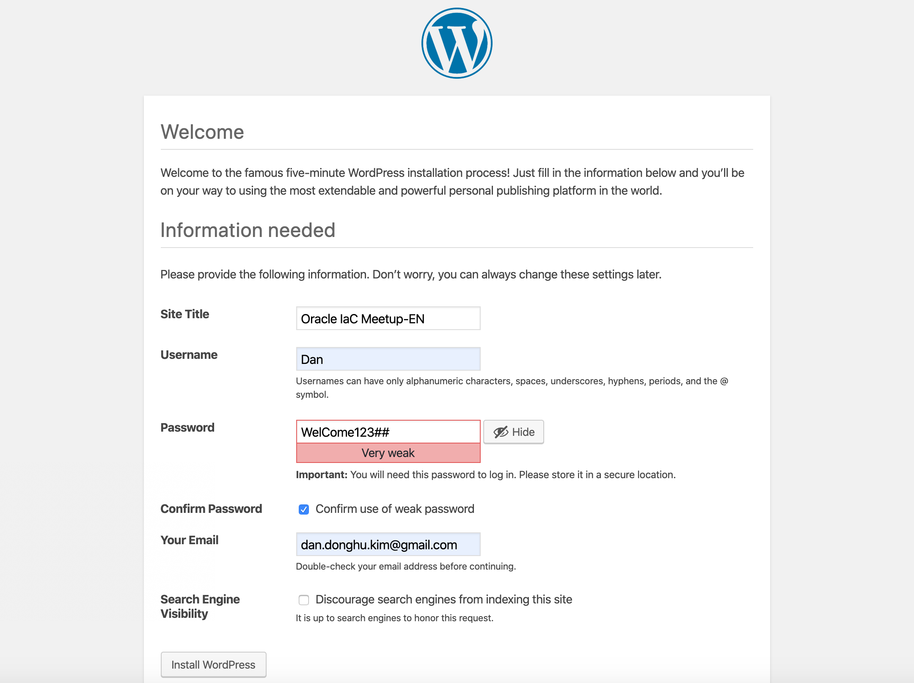

  * 2번 Instance의 Wordpress 구성 완료 화면 (한국어 버전)  
    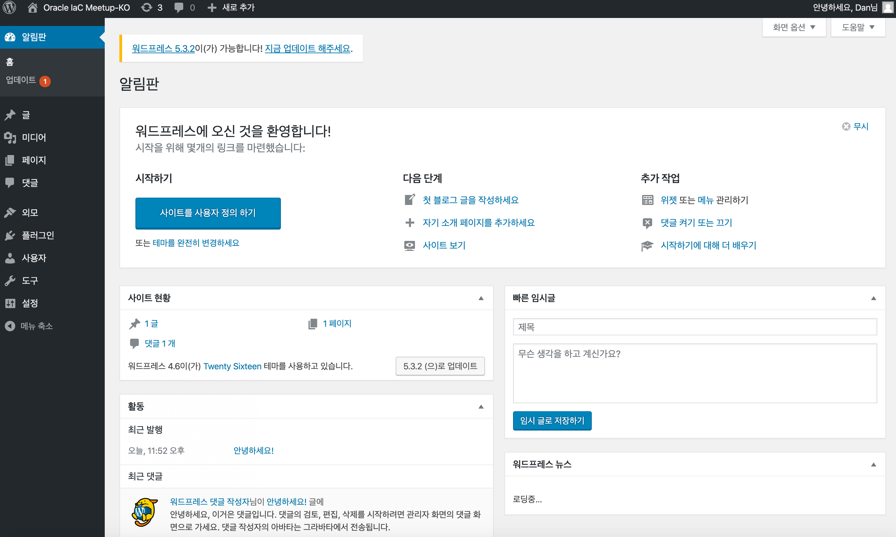

### Terraform Destroy
구성한 모든 Compute Instance와 VCN을 삭제합니다.

1. terraform 폴더로 이동
  ```shell
  $ (oci-ansible) cd ~/meetup-200118-iac/terraform 
  ```
  
2. Terrafory Destroy 실행

  ```shell
  $ (oci-ansible) terraform destroy -var-file="/home/user1/.terraform/env/env.tfvars" --auto-approve
  ```

</details>


<details>
<summary>
<font size=4>선택) Ansible을 활용한 프로비저닝 (Provisioning)</font>
</summary>

OCI에 Oracle Autonomous Data warehouse(ADW)를 프로비저닝해봅니다.

### ADW 인스턴스 생성
1. 실습용 Playbook 확인
    ```shell
    $ (oci-ansible) cd meetup-200118-iac/ansible/oci

    compartment.yml
    adw.yml
    ```

2. tenancy_ocid 확인
    아래 제공되는 config파일에서 tenancy의 id를 확인하고 메모합니다.

    ```shell
    $ (oci-ansible) cat ~/.oci/config

    [DEFAULT]
    tenancy=ocid1.tenancy.oc1..aaaaaaaaczntdhqaqsnfxfykq.................
    user=ocid1.user.oc1..aaaaaaaaecuviw4zez73bajvj4a7ccdkxkpz...........
    key_file=~/.oci/oci_api_key.pem
    fingerprint=48:1a:98:8c:cd:f...............
    region=ap-seoul-1
    ```

3. Oracle Ansible Module의 Default Logging Location은 **/tmp/oci_ansible_module.log** 입니다. 실습 환경이 여러 사용자가 사용하는 환경이므로, 해당 로그 파일의 위치를 변경해줘야 합니다. 
> 실행하면 다른 사용자가 생성한 파일에 접근하려고 하기 때문에 권한 오류 발생

  다음과 같이 환경 변수를 추가합니다.
  ```shell
  $ export LOG_PATH=~/meetup-200118-iac/ansible/oci
  ```

4. 먼저 ADW를 생성하기 위한 Compartment를 생성합니다. 다음은 Compartment 생성을 위한 Playbook입니다.
  
  * compartment.yml playbook 내용
    ```yml
    ---
    # Compartment Module
    - name: Compartment Module
      connection: local
      hosts: all
      tasks:
        - name: Create a compartment
          oci_compartment:
            parent_compartment_id: '{{ tenancy_ocid }}'
            name: ansible_compartment 
            description: Compartment for Ansible handson 
          register: result
          tags:
            - create_compartment
        - name: Delete compartment
          oci_compartment:
            compartment_id: '{{ compartment_ocid }}'
            state: absent
          register: result
          tags:
            - delete_compartment
        - name: Get details of a root compartment
          oci_compartment_facts:
            compartment_id: '{{ tenancy_ocid }}'
            name: '{{ compartment_name }}'
            fetch_subcompartments: True 
          register: result
          tags:
            - get_compartments
        - name: Print result
          debug:
            msg: '{{ result }}'
          tags:
            - always
    ```

5. 아래의 스크립트를 실행합니다. **{tenancy_ocid}** 부분을 위에서 메모한 tenancy_ocid로 대체하여 실행합니다.
    > 생성되는 Compartment명은 **ansible_compartment** 입니다.

    ```shell
    $ (oci-ansible) ansible-playbook -i ~/.ansible/roles/oracle.oci_ansible_modules/inventory-script/oci_inventory.py compartment.yml -t create_compartment -e "tenancy_ocid={tenancy_ocid}"
    ```

    예시입니다.
    ```shell
    $ (oci-ansible) ansible-playbook -i ~/.ansible/roles/oracle.oci_ansitory-script/oci_inventory.py compartment.yml -t create_compartment -e "tenancy_ocid=ocid1.tenancy.oc1..aaaaaaaagxn3didg4xptrk53xjrw3fvlvle5ma7a5s7vtk7vqbkru...."
    ```

6. 실행하면 Compartment가 생성되며, 생성된 결과가 다음과 같이 출력됩니다. 아래 id의 값을 메모합니다.
    > 아래 이미지에서 출력된 compartment_ocid는 생성된 compartment의 상위 ocid입니다. 생성된 compartment_ocid는 id의 값입니다.

    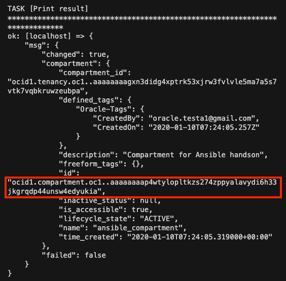
    

7. Oracle Autonomous Data Warehouse를 위에서 생성한 Compartment에 생성합니다. 다음은 ADW를 생성하기 위한 Playbook입니다.

  * adw.yml playbook
    ```yml
    ---
    # Create Autonomous Data Warehouse
    - name: Autonomous Data Warehouse Module
      connection: local
      hosts: all
      tasks:
        - name: Create Autonomous Data Warehouse
          oci_autonomous_data_warehouse:
            compartment_id: '{{ compartment_ocid }}'
            admin_password: 'WelCome123##'
            data_storage_size_in_tbs: 1
            cpu_core_count: 2
            db_name: 'ansible-adw'
            display_name: 'ansible-adw'
            license_model: 'LICENSE_INCLUDED'
            freeform_tags:
              owner: 'meetup-200108-iac'
            wait: False
            state: 'present'
          register: result
          tags:
            - create_adw
        # Delete Autonomous Data Warehouse
        - name: Delete Autonomous Data Warehouse
          oci_autonomous_data_warehouse:
            autonomous_data_warehouse_id: '{{ adw_ocid }}'
            state: 'absent'
          register: result
          tags:
            - delete_adw
        - name: Get Aunonomous Data Warehouse details of compartment
          oci_autonomous_data_warehouse_facts:
            compartment_id: '{{ compartment_ocid }}'
          register: result
          tags:
            - get_adw_details
        # Print ADW instance result
        - name: Print ADW instance result
          debug:
            msg: '{{ result }}'
          tags:
            - always
    ```

8. ADW 프로비저닝을 위해 다음과 같이 Ansible Playbook을 실행합니다. **{compartment_ocid}** 는 위에서 생성한 Compartment의 id로 대체합니다.
    ```shell
    $ (oci-ansible) ansible-playbook -i ~/.ansible/roles/oracle.oci_ansible_modules/inventory-script/oci_inventory.py adw.yml -t create_adw -e "compartment_ocid={compartment_ocid}"
    ```

    예시입니다.  
    ```shell
    $ (oci-ansible) ansible-playbook -i ~/.ansible/roles/oracle.oci_ansible_modules/inventory-script/oci_inventory.py adw.yml -t create_adw -e "compartment_ocid=ocid1.compartment.oc1..aaaaaaaau6jmp6bjbn35hjcgzfljvhkpo4daidyn2d..."
    ```

    생성되면 다음과 같은 결과를 확인할 수 있습니다. 생성된 ADW의 OCID를 메모합니다. (삭제 시 필요)  

    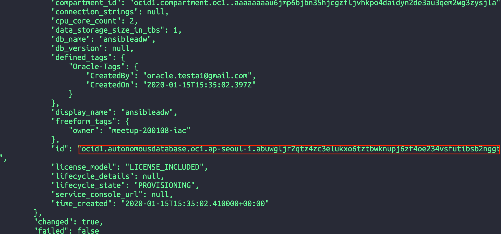

9. 생성된 ADW 인스턴스 확인
  OCI Console에 로그인 한 후 다음 페이지로 이동하여 생성된 ADW 인스턴스를 확인합니다.
    > 좌측 상단 햄버거 버튼 > Autonomous Data Warehouse > 좌측 **ansible-compartment** 선택

    생성된 ADW 인스턴스  

    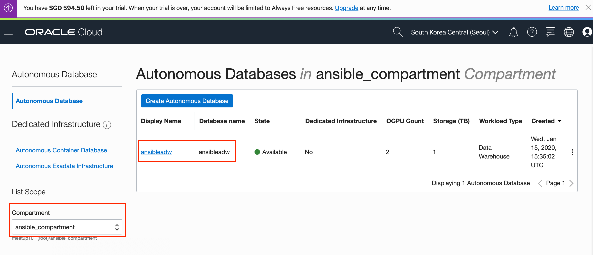

### ADW 인스턴스 삭제

  **{adw_ocid}** 부분을 위에서 생성 후 메모한 ADW id로 대체한 후 아래와 같이 실행합니다.
  ```shell
  $ (oci-ansible) ansible-playbook -i ~/.ansible/roles/oracle.oci_ansible_modules/inventory-script/oci_inventory.py adw.yml -t delete_adw -e "adw_ocid={adw_ocid}"
  ```

  예시입니다.
  ```shell
  $ (oci-ansible) ansible-playbook -i ~/.ansible/roles/oracle.oci_ansible_modules/inventory-script/oci_inventory.py adw.yml -t delete_adw -e "adw_ocid=ocid1.autonomousdatabase.oc1.ap-seoul-1.abuwgljr2qtz4zc3elukxo6tztbwknupj6zf4oe234vsfutibsb2nggtx2dq"
  ```

  ADW 인스턴스 삭제 확인

  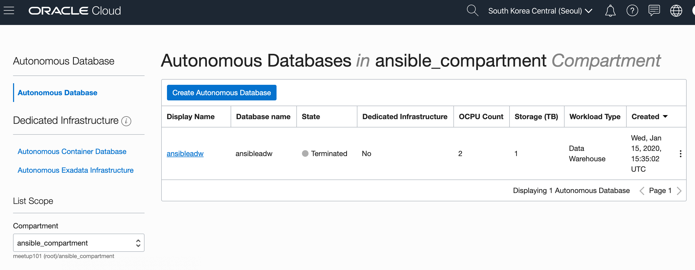

</details>
