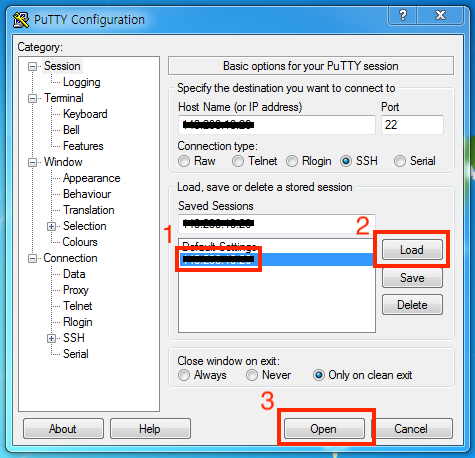
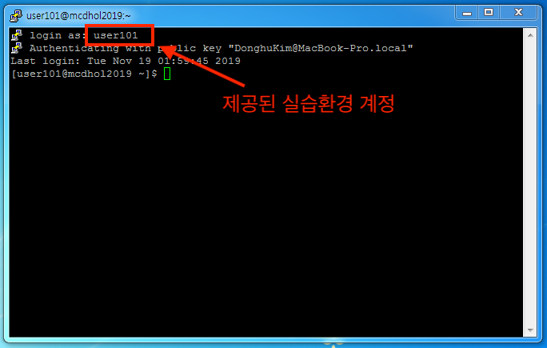

# Infrastructure as Code with OCI Hands-on


본 핸즈온 문서는 Terraform과 Ansible을 활용하여 Oracle Cloud Infrastructure (이하 OCI)에서 클라우드 환경에 대한 프로비저닝과 환경 구성하는 과정을 다루고 있습니다. 본 과정을 통해서 Terraform과 Ansible에 대한 기본 사용법과 코드를 통한 인프라 및 서버 구성 자동화에 대한 경험을 해볼 수 있습니다.

## Objectives
* Terraform과 Ansible 이해
* OCI에서 Terraform을 활용한 클라우드 프로비저닝 자동화 실행
* OCI에서 Ansible을 활용한 서버 구성 자동화 실행

## Required Artifacts
* 인터넷 접속 가능한 랩탑
* OCI (Oracle Cloud Infrastructure) 계정
* SSH Terminal (windows Putty, macOS Terminal 등)

## 환경 구성도
Terraform과 Ansible을 이용한 전체 실습 구성 이미지 한장


---

## 실습

### 실습 환경준비
1. 실습 환경(Linux)에 접속하기 위한 RSA Key Pair 다운로드 후 압축을 해제합니다.
    > https://objectstorage.ap-seoul-1.oraclecloud.com/p/q5QvhgdGpV5hakDgZXzjS-acLFR8oa3knciiVSS8CPg/n/apackrsct01/b/bucket-20190614-1639/o/sshkeys.zip

    Windows 사용자의 경우 putty를 사용합니다. 아래 경로에서 다운로드 받습니다.
    > https://objectstorage.ap-seoul-1.oraclecloud.com/p/3wkXVpnrGozrXsSHZLPvpGHxgFBB_yK5nphjF8iaPPY/n/apackrsct01/b/bucket-20190614-1639/o/putty.exe
 
2. 아래 URL로 접속해서 본인 이메일을 입력한 후 제출을 클릭하면 실습 환경정보를 확인할 수 있습니다.

3. 클라이언트 환경 접속
    접속을 위한 

    #### Windows (Putty)
    Connection - SSH - 키 입력하는 방식에 대한 이미지 추가

    Putty 접속
    

    Putty 접속 확인
    

    #### macOS Terminal
    ```
    $ ssh -i ~/sshkeys/id_rsa {osuser}@{client_ip}
    ```

4. 접속하면 다음과 같이 실습을 위해 제공되는 환경 구성 파일과 pem, rsa key를 확인할 수 있습니다.
    ```shell
    $ ls -lart

      drwxr-xr-x.  2 user1 handson    87  1월 10 04:43 .oci
      drwxr-xr-x.  3 user1 handson    17  1월 15 00:49 .terraform
      drwx------.  2 user1 handson    80  1월 15 00:55 .ssh
    ```

    > .oci    ----------> oci python sdk에서 oci에 접속하기 위한 정보와 PEM Key  
    > .terraform  ----> terraform 실습에서 사용할 환경 변수   
    > .ssh  ----------> terraform으로 생성하는 Compute 환경에 접속하기 위한 RSA Key

5. 접속한 실습 환경에서 실습을 위한 Terraform, Ansible 소스를 git clone을 통해서 다운로드 받습니다. ($는 입력하지 않습니다.)
```
$ git clone https://github.com/MangDan/meetup-200118-iac.git
```

<details>
<summary>
<font size=4>Terraform with OCI (Hands-On)</font>
</summary>

> 실습 환경에는 이미 Terraform이 설치되어 제공됩니다. Terraform 설치와 관련해서는 아래 URL을 참고합니다.  
> https://learn.hashicorp.com/terraform/getting-started/install.html

Terraform 설치 확인
```shell
$ terraform version
```

### 실습용 Terraform 소스 구조
OCI용 테라폼 프로젝트의 디렉토리 구조는 다음과 같습니다.
> 실습에서 사용되는 모듈은 compartment, vcn, compute입니다.

```shell
$ cd meetup-200118-iac/terraform
```

제공되는 샘플은 루트 경로에 provider.tf, main.tf, vars.tf가 존재하고 이를 사용해서 하위 모듈을 실행하는 형태로 구성되어 있습니다.
1. OCI provider 정의
2. terraform에서 사용할 변수 값을 정의하고 루트의 vars.tf에 값을 매핑
3. 실행할 모듈을 정의 (모듈로 변수값 전달)
4. 모듈별로 resource 정의


다음은 변수가 어떤식으로 할당되는지를 보여주는 그림입니다.

> Terraform의 변수는 기본적으로 환경변수 혹은 tfvars 파일에 정의한 값이 할당되는데, 할당된 변수값은 같은 위치의 Block Type (resource, data등)에서 참조합니다. 따라서 상위 변수의 값을 하위 모듈에 다시 매핑을 해야 하며, 하위 모듈의 경우도 동일하게 변수를 가지고 있어야 합니다.

변수가 매핑되는 순서입니다.
1. env.tfvars에 정의된 값을 루트의 vars.tf에 할당
2. 루트의 vars.tf를 main.tf, provider.tf에서 사용
3. 루트의 main.tf에서 하위 모듈(compute, compartment, vcn)이 가지고 있는 vars.tf에 값을 전달
4. 각 모듈에서 동일한 위치에 존재하는 vars.tf 참조


### Terraform Init
provider.tf가 있는 위치에서 다음과 같이 init을 실행합니다. 이 작업은 provider에서 제공하는 terraform plugin을 OS환경에 맞게 다운로드 혹은 업데이트하며, 실행할 모듈의 정보에 대한 내용을 json파일로 생성합니다.

```shell
$ cd meetup-200118-iac/terraform

$ terraform init
```

OCI Plugin과 Module 확인
```shell
$ tree .terraform

.terraform/
├── modules
│   └── modules.json
└── plugins
    └── linux_amd64
        ├── lock.json
        └── terraform-provider-random_v2.2.1_x4
```

### Terraform Plan
동일한 경로에서 다음과 같이 수행합니다.

```shell
$ terraform plan -var-file="~/.terraform/env/env.tfvars"
```


</details>

<details>
<summary>
<font size=4>Ansible with OCI (Hands-On)</font>
</summary>

* Configuration (후보군)
  * apache(nginx) + php + fpm
  * database (oracle, mongo...)
  * was (weblogic, jboss, tomcat)
  * ansible awx
  * kafka
  * monitoring (kibana, logstat, prometheus)
  * system infra (docker, kubernetes)
* Provisioning
  * ADW

### 실습 환경 (그림 한장)
* Ansible Control Server
* Ansible Target Server

### 실습 환경 구성
1. RSA Key Pair 다운로드

2. Ansible Control Server 접속

    #### Windows (Putty)
    Putty를 통해 접속 방법 가이드

    #### macOS Terminal
    ```
    $ ssh -i ~/.ssh/id_rsa user1@132.145.95.114
    ```

3. python, pip, virtualenv 설치 확인
    ```
    $ python --verion

    $ pip --version

    $ virtualenv --version
    ```

4. virtualenv 환경 생성 및 가상환경 실행
    ```
    $ virtualenv oci-ansible

    $ source ~/oci-ansible/bin/activate
    ```

5. Python 가상환경에 ansible 설치 및 확인
    ```
    $ (oci-ansible) $ pip install ansible

    $ (oci-ansible) $ ansible --version
    ```

6. OCI Python SDK 설치
    Ansible OCI Module에서는 OCI Python SDK를 사용하여 OCI에 접근합니다. 따라서 Ansible OCI Module을 사용하기 위해서는 OCI Python SDK 설치가 필요합니다.

    ```
    $ (oci-ansible) pip install oci
    ```

### Ansible OCI Module 다운로드, 설치, 접속 테스트
Ansible OCI Module은 Ansible Galaxy에서 Role로 제공되고 있으며, GitHub에서도 다운로드 받을 수 있습니다. 본 실습에서는 Ansible Galaxy에서 다운로드 받아서 설치를 진행합니다.

1. Ansible OCI Module 다운로드 (from Ansible Galaxy)
    ```
    $ (oci-ansible) ansible-galaxy install oracle.oci_ansible_modules
    ```

<details>
 <summary>참고) Ansible OCI Module from GitHub</summary>

 ```
$ (oci-ansible) git clone https://github.com/oracle/oci-ansible-modules.git
 ```

</details>

2. Ansible OCI Module 설치
    ```
    $ (oci-ansible) ~/.ansible/roles/oracle.oci_ansible_modules/install.py
    ```

3. Ansible OCI Module에서 제공하는 Dynamic Inventory를 사용하여 접속 테스트
    ```
    $ (oci-ansible) ansible-inventory -i .ansible/roles/oracle.oci_ansible_modules/inventory-script/oci_inventory.py --list
    ```

    아래와 같이 Compartment이름과 하위 Host IP 주소를 확인할 수 있습니다.
    ```
    "meetup-compartment-111": {
        "hosts": [
            "140.238.1.142"
        ]
    }
    ```

4. 위에서 확인한 Compartment명을 이용해서 해당 Host에 Ping 테스트를 수행합니다.
    ```
    ansible -i .ansible/roles/oracle.oci_ansible_modules/inventory-script/oci_inventory.py {compartment명} -u {사용자명} -m ping --private-key=~/.ssh/id_rsa
    ```

    접속할때마다 key를 입력하지 않도록 known_hosts에 등록하기 위해 yes를 입력합니다.
    ```
    The authenticity of host '140.238.1.158 (140.238.1.158)' can't be established.
    ECDSA key fingerprint is SHA256:88V1g6wPQ7pVuDLtKRl2E5XGzFdd1TpMITZcPPQm1SM.
    ECDSA key fingerprint is MD5:01:dc:0b:02:d3:e9:aa:a3:d9:e4:f5:61:3d:f5:59:a5.
    Are you sure you want to continue connecting (yes/no)? yes
    ```

    PING 테스트
    ```
    140.238.1.158 | SUCCESS => {
        "ansible_facts": {
            "discovered_interpreter_python": "/usr/bin/python"
        }, 
        "changed": false, 
        "ping": "pong"
    }
    ```

---


### Ansible을 활용한 서버 구성 (Configuration) 
OCI Compute (Linux)에 Apache + PHP-FPM 조합의 환경을 구성해봅니다.

### Ansible을 활용한 서버 프로비저닝 (Provisioning)
OCI에 Oracle Autonomous Data warehouse(ADW)를 프로비저닝해봅니다.

1. 실습용 소스 다운로드
    > git clone https://github.com/MangDan/Infrastructure-as-Code/ansible

2. tenancy_ocid 확인
    아래 제공되는 config파일에서 tenancy의 id를 확인하고 메모합니다.

    ```
    $ cat ~/.oci/config

    [DEFAULT]
    tenancy=ocid1.tenancy.oc1..aaaaaaaaczntdhqaqsnfxfykqymelumoplqe5d6amg7ecsaykku6ukiwc37q
    user=ocid1.user.oc1..aaaaaaaaecuviw4zez73bajvj4a7ccdkxkpz7axmcu5yjobtqny3dw753nda
    key_file=~/.oci/oci_api_key.pem
    fingerprint=48:1a:98:8c:cd:f6:63:4b:fb:4d:8d:26:44:aa:37:f6
    region=ap-seoul-1
    ```

3. 먼저 ADW를 생성하기 위한 Compartment를 생성합니다. 다음은 Compartment 생성을 위한 Playbook입니다.

  * compartment.yml playbook 내용
    ```yml
    ---
    # Compartment Module
    - name: Compartment Module
      connection: local
      hosts: localhost
      tasks:
        - name: Create a compartment
          oci_compartment:
            parent_compartment_id: '{{ tenancy_id }}'
            name: ansible_compartment 
            description: Compartment for Ansible handson 
          register: result
          tags:
            - create_compartment
        - name: Delete compartment
          oci_compartment:
            compartment_id: '{{ compartment_id }}'
            state: absent
          register: result
          tags:
            - delete_compartment
        - name: Get details of a root compartment
          oci_compartment_facts:
            compartment_id: '{{ tenancy_id }}'
            name: '{{ compartment_name }}'
            fetch_subcompartments: True 
          register: result
          tags:
            - get_compartments
        - name: Print result
          debug:
            msg: '{{ result }}'
          tags:
            - always
    ...
    ```

4. 아래의 스크립트를 실행합니다. **{{tenancy_ocid}}** 부분을 위에서 메모한 tenancy_ocid로 대체하여 실행합니다.

    ```
    $ ansible-playbook -i .ansible/roles/oracle.oci_ansible_modules/inventory-script/oci_inventory.py playbooks/compartment.yml -t create_compartment -e "{{ tenancy_ocid }}"
    ```

5. 실행하면 Compartment가 생성되며, 생성된 결과가 다음과 같이 출렵됩니다. 아래 id의 값을 메모합니다.

    
    

6. Oracle Autonomous Data Warehouse를 위에서 생성한 Compartment에 생성합니다. 아래는 ADW를 생성하기 위한 Playbook입니다.

  * adw.yml playbook
    ```yml
    ---
    # Create Autonomous Data Warehouse
    - name: Autonomous Data Warehouse Module
      connection: local
      hosts: localhost
      tasks:
        - name: Create Autonomous Data Warehouse
          oci_autonomous_data_warehouse:
            compartment_id: '{{ compartment_id }}'
            admin_password: 'WelCome123##'
            data_storage_size_in_tbs: 1
            cpu_core_count: 2
            db_name: 'ansible-adw'
            display_name: 'ansible-adw'
            license_model: 'LICENSE_INCLUDED'
            freeform_tags:
              owner: 'dan.donghu.kim@gmail.com'
            wait: False
            state: 'present'
          register: result
          tags:
            - create_adw
        # Delete Autonomous Data Warehouse
        - name: Delete Autonomous Data Warehouse
          oci_autonomous_data_warehouse:
            autonomous_data_warehouse_id: '{{ adw_id }}'
            state: 'absent'
          register: result
          tags:
            - delete_adw
        - name: Get Aunonomous Data Warehouse details of compartment
          oci_autonomous_data_warehouse_facts:
            compartment_id: '{{ compartment_id }}'
          register: result
          tags:
            - get_adw_details
        # Print ADW instance result
        - name: Print ADW instance result
          debug:
            msg: '{{ result }}'
          tags:
            - always
    ...
    ```

4. ADW 프로비저닝을 위해 다음과 같이 Ansible Playbook을 실행합니다.
  ```
  $ ansible-playbook -i .ansible/roles/oracle.oci_ansible_modules/inventory-script/oci_inventory.py playbooks/adw.yml -t create_adw -e "compartment_id={compartment ID}"
  ```

</details>

5. ADW Instance 확인
https://console.ap-seoul-1.oraclecloud.com/?tenant={Tenancy명}

제공된 ID/PW를 활용하여 접속, ADW 메뉴에서 생성된 ADW 인스턴스 확인

